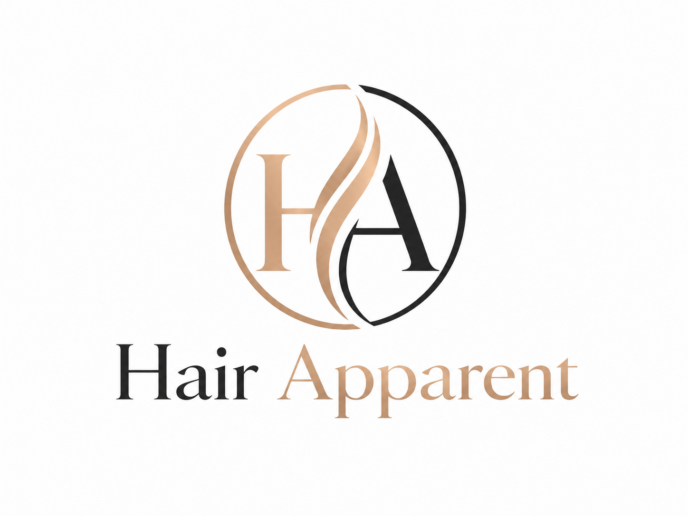

<p align="center">
  
</p>

# Hair Apparent

**Hair Apparent** is a browser-based AI hairstyle makeover app that helps people preview new haircut ideas on their own photo and create a salon-ready stylist brief.

The app is designed for GitHub Pages, runs as a static web app, and does **not** store user photos on a server. Users provide their own OpenAI API key for photorealistic image generation.

**Current build:** `2026.06.10.020`

---

## What Hair Apparent Does

Hair Apparent guides the user through a simple makeover flow:

1. Upload one clear primary face photo.
2. Choose style preferences.
3. Enter an OpenAI API key.
4. Generate six hairstyle preview cards.
5. Compare current and previous render batches.
6. Select a final look.
7. Save/share the preview image.
8. Generate a PDF stylist brief.

The goal is to make hairstyle exploration feel like a polished salon app instead of a long scrolling form.

---

## Major Features

### One Primary Photo

Hair Apparent now asks for **one clear primary face photo** instead of 5–10 photos.

This helps the image model preserve the person’s identity more consistently because the app is not trying to merge multiple reference faces.

Best results come from a photo that is:

- One person only
- Front-facing or mostly front-facing
- Well lit
- No hat, sunglasses, or hair covering the face
- Shows the head, face, neck, and upper chest
- Has space above the head

---

## Style Direction

Users can choose the overall presentation they want the AI to favor:

- **Masculine**
- **Feminine**
- **Show everything**

This helps avoid unwanted gender presentation changes. For example, when **Masculine** is selected, the prompt explicitly tells the model not to feminize the person.

---

## Hair Preference Controls

Hair Apparent now asks three practical hairstyle questions before generation.

### Length preference

**Pick what you would actually wear.**

- Short
- Medium
- Long
- Surprise me

### Daily effort

**Be honest.**

- Wash and go
- A few minutes
- I enjoy styling

### Goal

**Helps break ties.**

- Polished
- Easy / low-key
- Bold change

These preferences are used to filter and score the internal hairstyle catalog before the app chooses the six looks.

---

## Hairstyle Recommendation System

Hair Apparent uses a curated internal hairstyle catalog rather than asking the user to manually choose from a long list.

Each style includes:

- Hairstyle name
- Description
- Presentation category
- Length category
- Daily effort category
- Style goal category
- Prompt guidance for image generation

The app selects six styles that best match the user’s chosen direction, length, effort, and goal.

When the user clicks **Regenerate**, the newest six looks appear at the top of the page and previous successful renders move down into a **Previous renders** section so the user can continue comparing them.

---

## Photorealistic Image Generation

Hair Apparent uses the OpenAI Images API through the user’s own API key.

The app generates:

- Six hairstyle cards
- One image per card
- Name and description visible immediately
- Images that pop in as they finish rendering
- Status badges for each card:
  - Queued
  - Rendering
  - Ready
  - Error

Users can select a look as soon as that specific image is ready. They do **not** need to wait for all six renders to finish.

---

## Headshot Framing Requirements

Hair Apparent’s prompts emphasize that generated previews should show a useful salon-style headshot.

The desired framing is:

- Mid-chest or breast line upward
- Full face
- Full head
- Entire head of hair visible
- Shoulders and upper chest visible
- About a fist of empty background space above the highest point of the hair
- No cropping off the top of the hairstyle

This matters because a haircut preview is not useful if the top of the hair is cut off.

---

## Salon Makeover Backgrounds

Build 020 adds rotating salon background concepts to make the previews feel more like a special makeover experience.

The app randomly selects from salon-style settings such as:

- Modern salon
- Boutique salon
- Luxury stylist suite
- Editorial salon backdrop
- Barber-salon studio
- Warm natural-light salon
- Minimal professional salon
- Upscale makeover room
- Soft neutral studio
- Contemporary hair consultation space

These are prompt-based background directions, not stored image assets.

---

## Preview Speed Modes

Users can choose how the app balances speed and quality:

### Fast

Lower wait time. Uses lighter quality and more parallel rendering.

### Balanced

Recommended default. Good quality with moderate wait time.

### Best

Higher quality. Slower and more deliberate generation.

---

## Image Gallery

Generated images can be clicked or tapped to open a larger overlay preview.

The overlay includes:

- Large preview image
- Hairstyle name
- Description
- Previous / Next controls
- Swipe support on touch devices

The overlay can browse through all successful renders on the page, including previous batches.

---

## Final Look Screen

When the user selects a hairstyle, Hair Apparent opens a dedicated final look view.

The final view includes:

- The selected hairstyle image
- Hairstyle name
- Description
- Save / share photo button
- Save PDF stylist directions button
- Back to previous menu
- Start over with confirmation warning

---

## Save / Share Photo

The **Save / share photo** button uses the browser’s Web Share API when supported.

On iPhone and iPad, this can open the system share sheet, where the user may save the image to Photos.

If the browser does not support file sharing, the app falls back to downloading the image file.

---

## PDF Stylist Brief

Hair Apparent can generate a PDF stylist brief directly in the browser.

The PDF includes:

- Hairstyle name
- Hairstyle description
- Preview image
- Cutting and styling guidance
- Style direction
- Preview mode

The PDF is generated locally in the browser. When supported, the app opens the system share sheet with a single PDF file. Otherwise, it downloads the PDF.

---

## OpenAI API Key Handling

Hair Apparent does **not** include a developer API key in the code.

Users enter their own OpenAI API key.

The app supports:

- Session-only key use by default
- Optional **Remember my key on this device**
- Clear saved key button

### Is it free?

Hair Apparent itself is free and open source.

OpenAI image generation is not guaranteed to be free. Users may have free credits on their OpenAI account, but once those are used, OpenAI’s normal API billing applies to their account.

### Is storing the key safe?

Session-only storage is safest. Remembering the key on a device is convenient but should only be used on a private device.

Users should not save their key on shared or public computers.

---

## Privacy Model

Hair Apparent is built as a static browser app.

The app does not run a backend server and does not store user images.

Images are processed in the user’s browser and are sent to OpenAI only when the user generates hairstyle previews. OpenAI processes those requests according to the user’s OpenAI account terms.

The app itself does not collect, save, or upload photos to a Hair Apparent server.

---

## Current Technical Approach

Hair Apparent is currently a single-file web app designed for GitHub Pages.

The app uses:

- HTML
- CSS
- Vanilla JavaScript
- Browser local/session storage
- OpenAI Images API
- Web Share API when available
- In-browser PDF generation

No build step is required.

---

## Deployment

To deploy on GitHub Pages:

1. Rename the latest build file to `index.html`.
2. Upload or replace the existing `index.html` in the repository.
3. Keep the logo image at:

```text
assets/hair-apparent-logo.png
```

4. Commit the changes.
5. Wait for GitHub Pages to publish.
6. Refresh the site with a cache-busting query string if needed:

```text
https://your-username.github.io/your-repo/?v=2026-06-10-020
```

---

## Recommended Repository Structure

```text
/
├── index.html
├── README.md
├── LICENSE.md
└── assets/
    └── hair-apparent-logo.png
```

---

## Known Limitations

Hair Apparent is a browser-based prototype. Results may vary depending on:

- The source photo
- Lighting
- Face angle
- Hair coverage
- OpenAI image model behavior
- Browser support for sharing files
- API availability and account billing status

The app cannot guarantee a perfect haircut preview. It is intended as a visual brainstorming and salon communication tool.

---

## Future Improvements

Possible next improvements:

- Better face/photo validation before generation
- More hairstyle taxonomy data
- Hairstyle inspiration library with licensed references
- Better control over age preservation
- Optional manual style editing
- “Show only successful results” toggle
- More robust PDF layout
- Serverless proxy option for faster, more controlled image generation
- Optional local encrypted API key storage

---

## Developer

**Hair Apparent** is developed by **David Fliesen**, a veteran multimedia creator, AI designer, educator, and open-source project builder based in Summerville, South Carolina.

David is a retired U.S. Navy Chief Journalist / Combat Cameraman with experience in journalism, broadcasting, photography, multimedia production, training, instructional design, 3D animation, serious games, virtual worlds, and applied generative AI.

This project is part of David’s broader work exploring practical, browser-based AI tools that are useful, approachable, privacy-conscious, and easy to deploy on GitHub Pages.

### Links

- **Portfolio:** https://davidfliesen.github.io/
- **GitHub:** https://github.com/DavidFliesen
- **Hair Apparent live site:** https://davidfliesen.github.io/hairapparent/
- **LinkedIn:** https://www.linkedin.com/in/davidfliesen/

### Related Work

David’s related AI and web projects include:

- **Job Scouts AI** — an open-source browser-based AI job search assistant
- **TV Watchlist** — a personal web app for tracking shows
- **Sisters of Summerville** — an AI-assisted comic strip project

---

## License

Hair Apparent is released under the MIT License.

See [`LICENSE.md`](LICENSE.md) for details.

---

## Disclaimer

Hair Apparent is a creative AI preview tool. It is not a professional hairstylist, barber, colorist, or cosmetology substitute. Users should consult a licensed stylist before making major changes to their hair.
